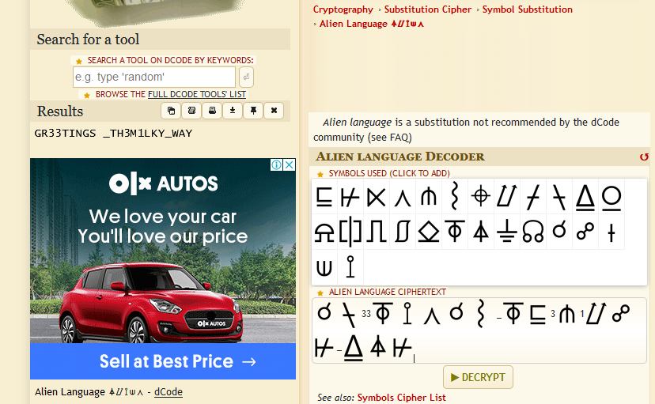

# FORENSIC

## Mysterious Radio Bursts 


This challenge was a easy steg challenge !

###Solution !!!
First I listened to the audio file it was like after few seconds it was something weired. I grabbed the file to Sonic Visualiser and view the Spectrogram ans it contained some kind of encoded flag !!

There was also a hint for this challenge 

Hmm aliens I have earlier used this Alien Language So I just went to dcode.fr and decode the flag !! (https://www.dcode.fr/alien-language)
Note : You will not be able to find some of the charaters like 3 and _ so just use your keyboard at that time !!

Lets go We have our easy flag !!!!
```Flag :Securinets{GR33TINGS_TH3M1LKY_WAY}```

### I really liked this challenge and Thanks to the challenge creator for this amazing challenge !!!
### Thankyou for reading my writeups !
