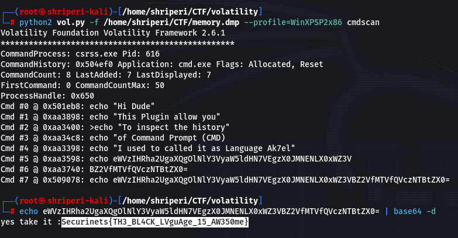
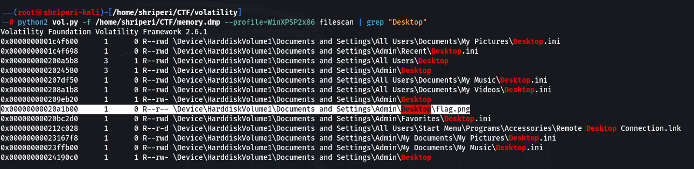
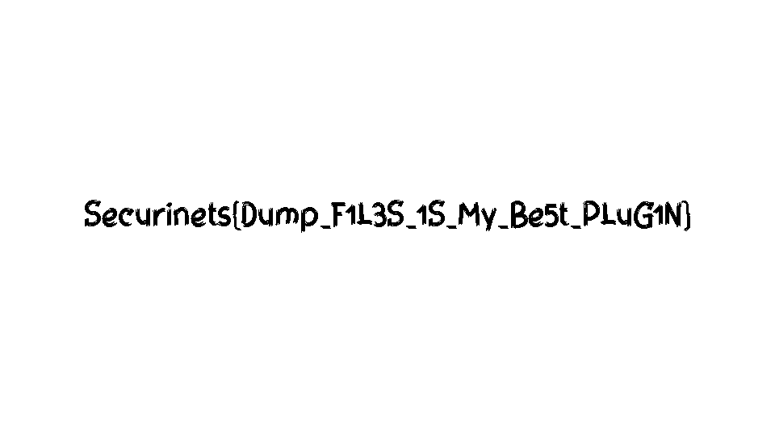

# FORENSIC

## The Pilot


This challenge was a pure image forensics challenge !! (Which I love to solve)
Challenge was divided into 14 parts.

###Q1) What volatility profile is the most appropriate for this machine? | Weight: +25

We are asked the most appropriate profile for the dump so we will just run image info and grab our flag !


```Flag : WinXPSP2x86```

###Q2) What is the MD5 hash of the memory dump? | Weight: +25 

Just run md5sum on the dump file .


```Flag : 9200b1d9e8804ca472695e1b66a7925f```

###Q3) What is the hostname? | Weight: +25

This was a tricky one We needed to find the invermetal details of the dump and grep out the computername .


```Flag : UNKNOWN-F549DD2```

###Q4) What is the PID of the Notepad process? | Weight: +25

Running pslist will give us our flag !


```Flag : 584```

###Q5) What is the PID of the Explorer process? | Weight: +25 

Again Running pslist will give us our flag !


```Flag : 1308```

###Q6) What is the parent process start time of notepad.exe? | Weight: +50

So in this part first we need to know the parent process of notepad.exe which is 1308 and the start time of 1308 is our flag !!


```Flag : 2022-08-31 15:04:15```

###Q7) What is the IP Address used by the machine? | Weight: +50

Running netscan dint worked (Its not supported in this profile) So I tryed connscan and i got the flag !!


```Flag : 192.168.1.130```

###Q8) What is the executable path for process ID 1164? | Weight: +75

This one took me a bit long to find the flag ! After a bit of searching in the output of cmdline there was the path of that exe file with its pid !!


```Flag : C:\WINDOWS\system32\ctfmon.exe```

###Q9) My Grandfather calls CMD, the Black Language, can you find the flag there? | Weight: +50

It was a easy one like you just needed to find the history of commands the user of that computer had run and we can easily find it by cmdscan !! After that we got a base64 string just decode it and we have our flag !!


```Flag : Securinets{TH3_BL4CK_LVguAge_15_AW350me}```

###Q10) My Grandfather is environmental, can you find the flag? | Weight: +75

We needed to run envars as mentioned in the question ,and We found a variable named flag is here yes and flag was in its value !!


```Flag : Securinets{V4r1Able_ENV_1S_Helpful}```

###Q11) My Grandfather left something in the Desktop, can you find it? | Weight: +100

As the author says it was in Desktop so We will see the files in Desktop

And lets go here we found a file names flag.png Now we need to extract it

Lets open the flag.png


###Q12) My Grandfather copied his password, can you find it? | Weight: +100

Hmm so the password was in the clipboard so lets run clipboard plugin 

ah Its having nothing Lets try with -v

And We have our flag !!

```Flag : Securinets{COpY_P4sT3_S4v3_ My_L1f3}```

###Q13)  Just one more mysterious flag, can you find it? | Weight: +200 

This one needed a bit of windows knowledge, In windows most of the things are in little indane so we just needed to grep out the result of strings !! 

```Flag : Securinets{StR1Ngs_h3lpfUL_But_FuCK_1t}```

###Q14) Main Flag: 

We needed to find the history of the browser so for this one we will use iehistory plugin .

after reviewing the output I got a pastebin link !!

Decoding base64 we got our flag !!

```Flag : Securinets{1_L0v3_CurL_FucK_Br0w5eRs}```

### I really liked this challenge and Thanks to the challenge creator for this amazing challenge !!!
###Thankyou for reading my writeups !
